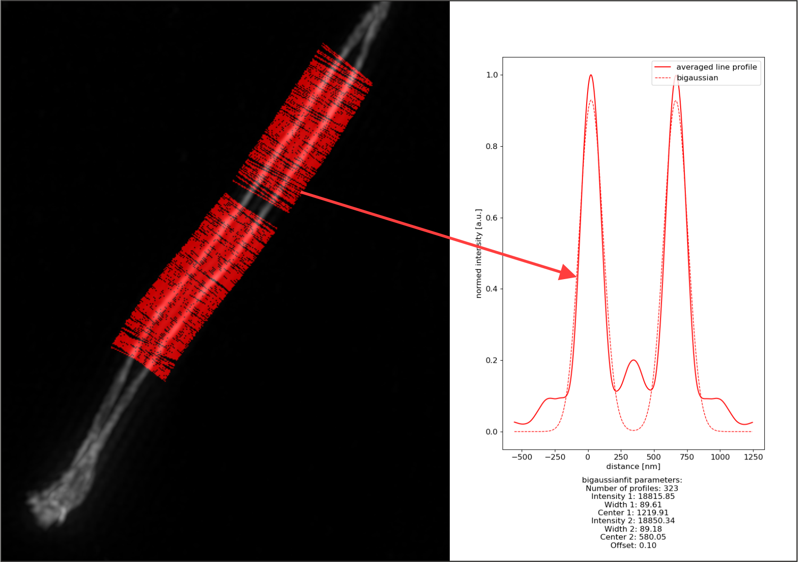

.. line_profiler documentation master file, created by
   sphinx-quickstart on Fri Jul 12 10:37:30 2019.
   You can adapt this file completely to your liking, but it should at least
   contain the root `toctree` directive.

Welcome to Line Profiler's documentation!
=========================================

Line profiler's purpose is to evaluate datasets in a biological/biophysical context. The software recognizes line shaped 
structures in image data and computes their mean position and orientation with sub-pixel accuracy. For each line a mean 
intensity profile is calculated. Utilising the whole image the software prevents biases, caused by preselecting data
subsets. 

Currently line profiler support's two modes:

.. figure:: fig/Microtub.jpg
   
    **Microtubule:** In Microtubule mode profiles are by default fitted with the intensity projection of a cylinder, applying the theoretical values for inner, outer radius and resolution.

.. figure:: fig/SNC.jpg
   
    **SNC:** In SNC mode the profiles are collected in the first color channel while using the second channel for fitting. This mode allows the usage of the parameters upper and lower limit. Profiles featuring two maximas with a distance, exceeding the restrictions are excluded. As well as profiles without two maximas.

	**SNC_canny**: In SNC_canny mode profiling and fitting happens in the first channel. The valid parameters for SNC and SNC_canny mode are identical.
	
.. note::
   
   **SNC_canny** mode should only be used if the second SNC channel can't be evaluated. **SNC** mode usually delivers superior results.

Getting started
===============

Line Profiler is precompiled for Windows and the binaries are available on `Zenodo <https://doi.org/10.5281/zenodo.3447793>`_.
Source code and user guide can be found on `Github <https://github.com/super-resolution/line_profiler>`_.

Functionality
==================

The concept of Line Profiler is to recongnize line like structures, reduce them to continous coordinates, smooth them, profile them and evaluate the results.
Therefore, multiple processing steps are nescesarry:

1) **[All modes]** The input image is convolved with a gaussian blur, compensating noise and intensity fluctuations. Using Lee's algorithm (1) a
skeletonize image is constructed reducing all expanded shapes to lines with 1 pixel width.

2) **[Microtubule, SNC]** The function :ref:`compute_line_orientation<Utility package>` rearanges all pixels unequal zero, to continuous lines. 
Meaning, i.e. that sharp edges are excluded, dividing one line in two independendly fitted structures. 
The pixel coordinates of each line are fitted with a c-spline. The local derivative of the c-spline gives the direction 
for placing the line profiles.

3) **[SNC, SNC_canny]** In SNC mode a :ref:`floodfill<floodfill>` image is constructed. A floodfill image is a binary image containing ones for
encapsuled structures and zeros everywhere else. Applying a distance transform gives the distance of each pixel unequal to zero, to the next
zero pixel. The maximum value of the distance transform gives the desired positions in the center of the 2D projected SNC helix.
All pixels in the floodfill image with a distance transform smaller than 0.4 of the maximum distance value are set to zero.
Finally an ``and`` operation is applied to the line coordinates and the floodfill image, excluding all coordinates which aren't located
in the desired area.

4) **[SNC_canny]** The channel containing the helix structure is processed with an edge finding algorithm (Canny).
For each candidate pixel (pixel unequal zero from step 3) the closest egde pixel is selected und the profile is constructed 
according to it's gradient direction.

5) **[All modes]** For each line and for the overall image a mean line profile is computed. The result can be fitted with a couple of suitable
functions described in :ref:`fitter<fitter>`.

.. note::
   
   In Microtubule mode line profiles are aligned according to the fitted spline. 
   
   In SNC mode line profiles are aligned according to the center of the first and second global maximum.

.. image:: fig/FlowChartMicrotuboli.jpg
   :width: 98%

Indices and tables
==================

* :ref:`genindex`
* :ref:`modindex`
* :ref:`search`

.. toctree::
   :maxdepth: 2
   :caption: Packages:
   
   controllers.utility
   controllers.fitter
   
