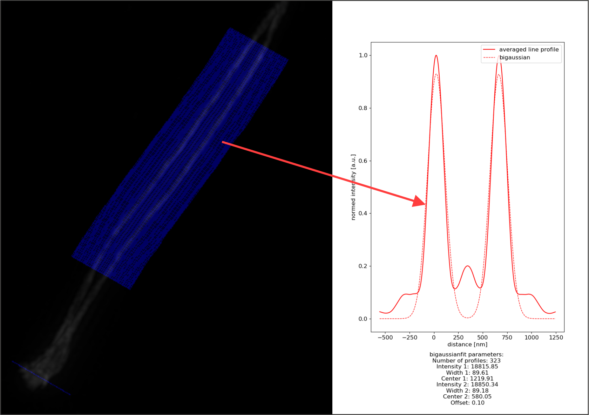

.. line_profiler documentation master file, created by
   sphinx-quickstart on Fri Jul 12 10:37:30 2019.
   You can adapt this file completely to your liking, but it should at least
   contain the root `toctree` directive.

Welcome to Line Profiler's documentation!
=========================================

With LineProfiler we developed a tool to evaluate the quality and expansion factor of ExM treated biological datasets. The software recognizes line shaped structures in image data and fits them to a cubic spline, computing their mean position and orientation.
We used the software to evaluate microtubule data from different ExM protocols. 
We were able to measure peak-to-peak distances of microtubule side walls for data labelled either with conventional primary and secondary antibodies (pab-sab), or custom made DNA conjugated antibodies. Here, we could distinguish between pre- and/or post-labelled data, according to our theoretical predictions. 
We were further able to use the software on expanded synaptonemal complex (SC) data. We fitted a c-spline on the centre protein SYCP1N of the helical SC structure. In combination with a distance transform on the lateral element protein SYCP3, we identified regions, where the helix structure is in frontal view. 
Utilizing these, we analysed the distance between the two SYCP3 strands. The combination of spline fitting and cross-sectional profiling allowed us to evaluate the maximum distance of the SC in unexpanded and expanded samples and use this as a tool to determine the structural expansion factor.

Currently line profiler support's three modes:

.. figure:: fig/Microtub.jpg
   
    **Microtubule:** In Microtubule mode profiles are by default fitted with the intensity projection of a cylinder, applying the theoretical values for inner, outer radius and resolution.

.. figure:: fig/SNC.jpg
   
    **SNC:** In SNC mode the profiles are collected in the first color channel while using the second channel for fitting. This mode allows the usage of the parameters upper and lower limit. Profiles featuring two maximas with a distance, exceeding the restrictions are excluded. As well as profiles without two maximas.

	**SNC one channel**: In SNC one channel mode profiling and fitting happens in the first channel. The valid parameters for SNC and SNC one channel mode are identical.

Getting started
===============

Line Profiler is precompiled for Windows and the binaries are available on `Zenodo <https://doi.org/10.5281/zenodo.3447793>`_.
Source code and user guide can be found on `Github <https://github.com/super-resolution/line_profiler>`_.

Functionality
==================

The concept of Line Profiler is to recongnize line like structures, reduce them to continous coordinates, smooth them, profile them and evaluate the results.
Therefore, multiple processing steps are nescesarry:

    .. container:: leftside
		
		.. figure:: fig/flow_chart_profiler.png
			:width: 100%

    .. container:: rightside

		1) **[All modes]** The input image is convolved with a gaussian blur, compensating noise and intensity fluctuations. Using Lee's algorithm (1) a
		skeletonize image is constructed reducing all expanded shapes to lines with 1 pixel width.

		2) **[All modes]** The function :ref:`compute_line_orientation<Utility package>` rearanges all pixels unequal zero, to continuous lines. 
		Meaning, i.e. that sharp edges are excluded, dividing one line in two independendly fitted structures. 
		The pixel coordinates of each line are fitted with a c-spline. The local derivative of the c-spline gives the direction 
		for placing the line profiles.

		3) **[SNC, SNC one channel]** In SNC mode a :ref:`floodfill<floodfill>` image is constructed. A floodfill image is a binary image containing ones for
		encapsuled structures and zeros everywhere else. An logical ``AND`` operation is applied to the line coordinates and the floodfill image, excluding all coordinates which aren't located
		in the desired area.

		4) **[SNC, SNC one channel]** A line profile is constructed perpendicular for each remaining pixel coordinate perpendicular to its derivative.
		The peak to peak distance is computed by splitting the profile in the middle (estimated center) and fitting a gaussian function to each half. 
		The distance between the estimated center of the gaussian fits is saved in the textfile ``distances.txt``.

		5) **[All modes]** For each line and for the overall image a mean line profile is computed. The result can be fitted with a couple of suitable
		functions described in :ref:`fitter<fitter>`.

		6) **[SNC, SNC one channel]** The averaged profile tends to underestimate the true peak to peak distance, due to data collected in regions where the SNC already started to twist (Non frontal View).
		Therefore, we provide a script, fitting a rightsided halfnorm to the histogramized distances. Simulations show that this approach yields a much better approximation.

.. note::
   
   GUI usage of the histogram fit will be available in the next release.
   
.. note::
   
   In Microtubule mode line profiles are aligned according to the fitted spline. 
   
   In SNC mode line profiles are aligned according to the center of the first and second global maximum.

Indices and tables
==================

* :ref:`genindex`
* :ref:`modindex`
* :ref:`search`

.. toctree::
   :maxdepth: 2
   :caption: Packages:
   
   controllers.utility
   controllers.fitter
   
